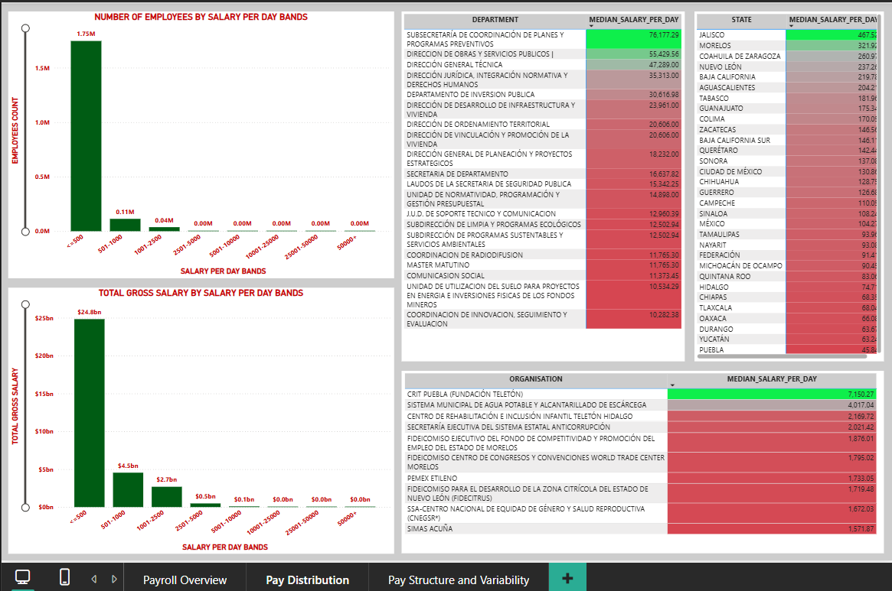

# PAYROLL ANALYSIS OF REPORTED SALARY RECORDS (MEXICO)

## 1. Project Overview

This project analyses salary data using Power query and Power BI to understand distribution, medians, and variation.

## 2. Tools Used

* Power query
* Power BI

## 3. Dataset

* Source: salaries
* Data contains: STATE, ORGANISATION, DEPARTMENT, JOB_TITLE, PERSON_NAME, NET_SALARY, GROSS_SALARY, REPORT_START_DATE, REPORT_END_DATE

## 4. Steps Followed

### Cleaned and Transformed data in Power query and Power BI

* There is 72833 categories in job titles column alone. More than 1177771 distinct names. 2565 distinct organisations. And same way 91411 departments too. In state column there are 31 states. Totally there is more than 19lakh rows.

* In the name column, the same person appears multiple times. These are not duplicates. Some rows are salary adjustments, and some represent a fixed salary for a specific period, followed by an increased salary for a later period.

* The time periods are not consistent across records. Each person has different start and end dates, and the years also vary. Therefore, the data does not represent a single common time period for all employees.

* Translated the column names from Spanish (Mexico) to English.

* Trimmed extra spaces, removed non-printable characters, and converted text to uppercase.

* Removed line breaks from text fields.

* Set correct data types for all columns. Used Spanish (Mexico) for dates.

* Checked for errors.

* Did not remove duplicates because INFORMATION_ID is unique for every row.

* Checked start and end dates. Rows where the end date is before the start date were flagged in the DATE_VALIDITY_STATUS column as INVALID.

* Removed the DESIGNATION column because it contained the same values as the JOB_TITLE column.

* Removed rows where gross salary was missing or zero, as they have no financial impact.
  Net salary rows still contain nulls and zero, but these were kept because gross salary was present.
  Net salary values were not filled or changed, as doing so would break the logical relationship between gross and net salary.

* Filled missing and 'EN BLANCO' person names with NAME UNKNOWN.

* Removed Blank Date rows.

* Fixed incorrect years such as 0018 and 0019 by converting dates to text, correcting the year, and converting them back to date format.

* In the GROSS_SALARY_FLAG column, negative gross salaries were marked as ADJUSTMENTS. Very small positive values (for example 0.01, 1, 2) were kept as NORMAL because no valid minimum salary threshold was available.

* Job title values contained many numbers and mixed formats. Only missing values were filled with UNKNOWN JOB TITLE.

* Department values also contained many mixed formats. Only missing values were filled with UNKNOWN DEPARTMENT.

* Person name, department, and job title were not heavily cleaned because there was no official reference to standardise them. Only blanks were handled.

* Flagged cases where net salary is greater than gross salary in the NET_GREATER_THAN_GROSS column as INVALID.

* Salary periods vary, so gross salary was converted to a daily amount in SALARY_PER_DAY column using the NUMBER_OF_DAYS_WORKED column created using start and end dates. This avoids issues caused by different month lengths.
  For rows with zero or negative days worked in NUMBER_OF_DAYS_WORKED column, daily salary was left blank on purpose in the SALARY_PER_DAY column.

### Used Power BI DAX for basic analysis

* Created measure Employees (Count of distinct Employees)
* Created measure Employees count (Count of total Employees)
* Created measure States (Count of distinct States)
* Created measure Organisations (Count of distinct Organisations)
* Created measure Job titles (Count of distinct Job titles)
* Created measure Departments (Count of distinct Departments)
* Created measure total gross salary
* Created column SALARY_BANDS
* Created column SALARY_BANDS_SORT
* Created measure median salary per day excluding adjustments, date inconsistencies
* Created salary per day standard deviation measure excluding adjustments and other negative values

### Created report using Power BI visuals

#### Page 1: Payroll Overview

* Cards provide distinct counts of employees, organisations, states, departments, and job titles.
* Bar chart shows state-wise total gross salary.
* Tree map shows organisation-wise contribution to total gross salary.

#### Page 2: Pay Distribution

* Column charts show salary-per-day bands by total gross salary and employee count.
* Matrices display median salary per day by organisation, state, and department.

#### Page 3: Pay Structure and Variability

* Scatter plot compares organisation-wise median salary per day against total gross salary.
* Scatter plot highlights salary dispersion using standard deviation against total gross salary.

## 5. Key Insights

* [Insight 1]
* [Insight 2]
* [Insight 3]

## 6. Screenshots

### Page 1: Payroll Overview

### Page 2: Pay Distribution

### Page 3: Pay Structure and Variability

## 7. Files Included

* `Payroll_Analysis_Mexico.pbix` – Power BI report
* `README.md` – Project description

## 8. How to Use

* Open `Payroll_Analysis_Mexico.pbix` in Power BI Desktop to explore the visuals and to view the cleaned data.
If you want, next I can trim this to **recruiter-optimised length** without changing meaning.

